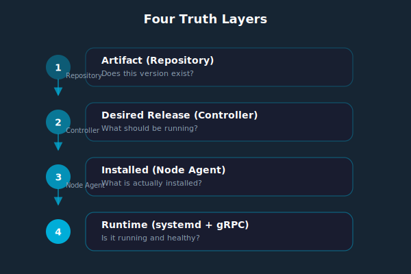
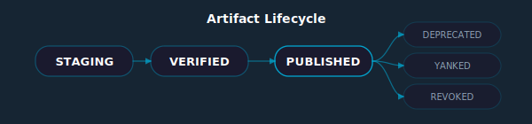
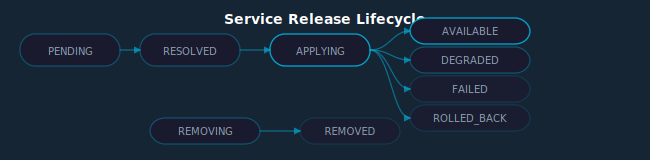

# Globular Convergence Model

The convergence model is the core mechanism by which Globular turns operator intent into running services. When an operator declares "service X should be at version Y," the convergence model detects the gap between that declaration and reality, creates a workflow to close the gap, executes it, and verifies the result.

This page explains how convergence works in detail: the four truth layers it operates on, how drift is detected, how workflows are dispatched and executed, how failures are handled, and how the system prevents runaway reconciliation.

## The Four Truth Layers

Globular's convergence model operates across four independent truth layers. Each layer represents a different question about the state of a package, and each layer has its own authoritative data source and owner.



### Layer 1: Artifact

**Source**: Repository service (MinIO object storage + etcd manifest registry)
**Owner**: `globular pkg publish` command or CI pipeline
**Key data**: `ArtifactManifest` — publisher, name, version, platform, build number, SHA256 checksum, provenance, publish state

An artifact enters this layer when it is published to the repository. It progresses through lifecycle states:



- **STAGING**: Upload in progress, not yet validated
- **VERIFIED**: Checksum validated, discoverable by the platform
- **PUBLISHED**: Fully available for deployment
- **DEPRECATED**: Superseded by a newer version, still downloadable but not recommended
- **YANKED**: Removed from discovery (existing installations unaffected)
- **REVOKED**: Permanently removed, active replacement recommended

The artifact layer is the foundation. If a version doesn't exist here as `PUBLISHED`, it cannot be deployed — no matter what the desired state says. This prevents deploying unverified or corrupted packages.

### Layer 2: Desired Release

**Source**: Cluster Controller etcd store at `/globular/resources/DesiredService/{name}`
**Owner**: Operator via `globular services desired set` or automated seeding
**Key data**: `DesiredService` — service name, target version, publisher, platform, build number

The desired release layer captures operator intent. It answers: "What version of each service should be running across the cluster?"

A desired-state entry is created when an operator runs:

```bash
globular services desired set postgresql 0.0.3 --publisher core@globular.io
```

This writes a `DesiredService` record to etcd:

```json
{
  "service_id": "postgresql",
  "version": "0.0.3",
  "publisher_id": "core@globular.io",
  "platform": "linux_amd64",
  "build_number": 0
}
```

The desired-state layer is independent of the artifact layer. You can set a desired version that doesn't yet exist in the repository — the system will detect this as a `Missing in repo` condition and report it. The controller does not silently skip missing artifacts; it classifies the problem and tracks it.

### Layer 3: Installed Observed

**Source**: Node Agent etcd store at `/globular/nodes/{node_id}/packages/{kind}/{name}`
**Owner**: Node Agent (auto-populated after workflow execution)
**Key data**: `InstalledPackage` — name, version, build number, checksum, status, timestamps, operation ID

The installed layer records what is actually on each machine. After a workflow successfully installs a package, the Node Agent writes an `InstalledPackage` record:

```json
{
  "node_id": "node-abc123",
  "name": "postgresql",
  "version": "0.0.3",
  "kind": "SERVICE",
  "checksum": "sha256:a1b2c3d4...",
  "status": "installed",
  "installed_unix": 1712937600,
  "updated_unix": 1712937600,
  "build_number": 1,
  "operation_id": "wf-run-xyz789"
}
```

The status field tracks the package lifecycle on the node:
- `installed` — successfully installed and verified
- `updating` — workflow in progress, new version being applied
- `failed` — last workflow step failed, package may be in inconsistent state
- `removing` — package is being uninstalled

### Layer 4: Runtime Health

**Source**: systemd unit state + gRPC health check responses
**Owner**: systemd (process supervision) and the Envoy gateway (health probing)
**Key data**: Unit active state, health check response, last contact timestamp

The runtime layer answers: "Is the service actually running right now?" A package can be `installed` (Layer 3) but not running — for example, if the systemd unit crashed after installation, or if the service is failing its health check.

Runtime health is assessed through two mechanisms:
1. **systemd unit state**: The Node Agent queries `systemctl` for unit status (active, inactive, failed, activating)
2. **gRPC health check**: The Envoy gateway or monitoring service probes the service's health endpoint

### Why Four Layers?

A common simplification would be to collapse these layers — for example, treating "desired" and "installed" as a single state, or assuming that "installed" means "running." Globular explicitly rejects this simplification because each layer can fail independently:

- **Repository failure**: The artifact might be corrupted, yanked, or unavailable (MinIO down). Layer 1 fails, but Layer 2 still reflects intent.
- **Deployment failure**: The workflow might fail during installation. Layer 2 says "version 0.0.3" but Layer 3 says "version 0.0.2" (the old version is still installed).
- **Runtime failure**: The installation succeeded but the service crashed on startup. Layer 3 says "installed" but Layer 4 says "unhealthy."
- **Drift**: Someone manually upgraded a binary outside Globular's management. Layer 3 now shows a version that doesn't match Layer 2.

By keeping the layers independent, the system can precisely diagnose what went wrong and at which stage. The repair command can compare all four layers and generate the minimal set of actions to fix any discrepancies.

## Drift Detection

Drift is any difference between what **should** be true (desired state) and what **is** true (installed state and runtime health). Globular detects drift through two complementary mechanisms.

### Hash-Based Change Detection

Every Node Agent computes an `AppliedServicesHash` — a fingerprint of all installed package versions on that node. This hash is included in every heartbeat sent to the Cluster Controller.

The controller also computes an expected hash based on the desired state for that node's profiles. When a heartbeat arrives:

1. Controller extracts the `AppliedServicesHash` from the heartbeat
2. Controller computes the expected hash from the desired state for that node
3. If the hashes differ, the controller flags the node as "converging" or "drifted"
4. The controller examines the `installed_versions` map in the heartbeat to identify which specific services are mismatched
5. For each mismatched service, the controller checks if a workflow is already in progress
6. If no workflow exists, the controller creates one

This mechanism detects drift within one heartbeat interval (default: 30 seconds). It catches:
- Services at the wrong version
- Services missing entirely
- Services present that shouldn't be (unmanaged)

### Periodic Reconciliation

In addition to heartbeat-driven detection, the controller runs a periodic reconciliation loop. Every reconciliation cycle:

1. Iterates over all `DesiredService` records
2. For each record, calls `ensureServiceRelease()` to guarantee a `ServiceRelease` object exists
3. For releases in `PENDING` or `RESOLVED` state, dispatches workflows

This catches cases where drift was detected but the workflow wasn't dispatched (for example, if the controller restarted after detecting drift but before dispatching the workflow).

The reconciliation loop is protected by a circuit breaker. If the Workflow Service is unreachable or returns repeated errors, the breaker opens and reconciliation pauses until the Workflow Service recovers. This prevents the controller from queuing thousands of workflows that can't execute.

### Cross-Layer Comparison

The `globular services repair` command performs a comprehensive cross-layer comparison:

```bash
globular services repair --dry-run
```

This command:
1. Queries the Repository service for all published artifacts (Layer 1)
2. Reads the desired-state store from the controller (Layer 2)
3. Queries each Node Agent for installed packages (Layer 3)
4. Checks runtime health for each installed service (Layer 4)
5. Compares all four layers and classifies each package:

| Status | Meaning | Layers |
|--------|---------|--------|
| **Installed** | All layers aligned, service converged | L2 = L3, L4 healthy |
| **Planned** | Desired state set, not yet installed | L2 present, L3 absent |
| **Available** | In repository, no desired release | L1 present, L2 absent |
| **Drifted** | Installed version differs from desired | L2 ≠ L3 |
| **Unmanaged** | Installed without a desired-state entry | L3 present, L2 absent |
| **Missing in repo** | Desired or installed, artifact not found | L2/L3 present, L1 absent |
| **Orphaned** | In repository, not desired, not installed | L1 present, L2/L3 absent |

Without `--dry-run`, the repair command takes corrective action:
- **Planned** services: Triggers workflow dispatch
- **Drifted** services: Creates workflows to install the desired version
- **Unmanaged** services: Imports them into the desired state (via seeding)
- **Missing in repo**: Reports the problem (requires manual re-publish)

## Workflow Dispatch

When the controller detects drift that requires action, it dispatches a workflow through a series of carefully controlled steps.

### Release Object Creation

For each drifted service, the controller creates or updates a **ServiceRelease** object:

```
/globular/resources/ServiceRelease/{service_name}
```

The release object tracks the lifecycle of bringing a specific service to its desired version:



- **PENDING**: Release created, awaiting resolution
- **RESOLVED**: Artifact found in repository, checksums validated, ready for deployment
- **APPLYING**: Workflow in progress, at least one node is being updated
- **AVAILABLE**: All target nodes converged successfully
- **DEGRADED**: Some nodes converged, others failed
- **FAILED**: No nodes converged, workflow exhausted retries
- **ROLLED_BACK**: Deployment was rolled back to the previous version
- **REMOVING**: Service is being uninstalled
- **REMOVED**: Service fully removed from all nodes

### Backoff and Deduplication

The controller implements several safeguards against redundant or premature workflow dispatch:

**5-Minute Backoff**: If a release has previously failed or been rolled back, the controller waits 5 minutes before creating a new workflow attempt. This prevents tight retry loops where a fundamentally broken deployment retries every reconciliation cycle.

**Deduplication**: Before dispatching a workflow, the controller checks if a workflow with the same `correlation_id` is already running. The correlation ID is constructed from the release kind, component name, and node ID:

```
correlation_id = "{release_kind}/{component_name}/{node_id}"
```

If a workflow with this correlation ID is in `PENDING` or `EXECUTING` state, the controller skips dispatch. This prevents duplicate workflows for the same operation.

**Semaphore**: The controller limits concurrent workflow executions (default: 3). If the semaphore is full, new dispatches queue until a slot opens. This prevents a large desired-state change from overwhelming the cluster.

### Trigger Reasons

Each workflow is tagged with the reason it was created:

| Trigger | Meaning |
|---------|---------|
| `DESIRED_DRIFT` | Desired state doesn't match installed state |
| `BOOTSTRAP` | Day-0/Day-1 cluster initialization |
| `RETRY` | Automatic retry after a previous failure |
| `MANUAL` | Operator explicitly requested the operation |
| `DEPENDENCY_UNBLOCKED` | A blocking dependency is now satisfied |
| `UPGRADE` | Version upgrade (desired version changed) |
| `REPAIR` | Repair command triggered the operation |

The trigger reason is recorded in the workflow run and is visible in workflow history. This makes it possible to answer questions like "why was this service restarted?" — because the trigger reason, combined with the run history, provides a complete audit trail.

## Workflow Execution

Once dispatched, a workflow executes through a sequence of phases. Each phase contains one or more steps, each assigned to an actor.

### Execution Phases

A typical service deployment workflow progresses through these phases:

**Phase 1: DECISION**
Actor: `CLUSTER_CONTROLLER`
- Validate that the desired service entry exists
- Resolve the target artifact version and build number
- Verify the artifact exists in the repository (Layer 1 → Layer 2 bridge)
- Identify target nodes based on profile assignments

**Phase 2: FETCH**
Actor: `NODE_AGENT` (per target node)
- Download the `.tgz` package from MinIO to the staging directory (`/var/lib/globular/staging/`)
- Record the download checksum

**Phase 3: INSTALL**
Actor: `INSTALLER` (via Node Agent)
- Verify the downloaded checksum matches the artifact manifest (deterministic integrity)
- Extract the binary to the installation path (`/usr/local/bin/`)
- Write or update the systemd unit file
- Update file permissions

**Phase 4: CONFIGURE**
Actor: `NODE_AGENT`
- Write service configuration to etcd
- Update local configuration files if needed
- Register the service endpoint in etcd

**Phase 5: START**
Actor: `RUNTIME` (via Node Agent)
- Run `systemctl daemon-reload` (if unit file changed)
- Run `systemctl restart <service_name>`
- Wait for the unit to reach `active (running)` state

**Phase 6: VERIFY**
Actor: `NODE_AGENT`
- Probe the service's gRPC health endpoint
- Wait for a healthy response (with timeout)
- If healthy: update the `InstalledPackage` record in etcd (Layer 3)
- Clean up the staging directory

**Phase 7: COMPLETE**
Actor: `WORKFLOW_SERVICE`
- Mark the workflow run as `SUCCEEDED`
- Update the release status (APPLYING → AVAILABLE)
- Notify the controller that convergence is achieved for this node

### Step-Level Failure Handling

Each step in the workflow has its own failure handling:

1. **Immediate retry**: For transient failures (network timeout, temporary MinIO unavailability), the step is retried immediately up to a configurable limit
2. **Classified failure**: If retries are exhausted, the failure is classified (CONFIG, PACKAGE, DEPENDENCY, etc.)
3. **Backoff**: The workflow enters `RETRYING` state with exponential backoff before the next attempt
4. **Blocking**: If the failure is due to a dependency (another service must be installed first), the workflow enters `BLOCKED` state and waits
5. **Final failure**: If all retries are exhausted, the workflow enters `FAILED` state

### Run-Level Failure Handling

At the workflow run level:

- **Retry with backoff**: Failed runs can be automatically retried. Each retry creates a new `run_id` but preserves the `correlation_id` and increments the `retry_count`. The `parent_run_id` links the retry to the original failed run.
- **Supersession**: If a newer desired-state change arrives while a workflow is running, the old workflow is marked `SUPERSEDED` and a new one starts.
- **Rollback**: If a deployment fails and a rollback is appropriate, the workflow creates a new run that installs the previous known-good version.
- **Operator acknowledgment**: Failed workflows can be acknowledged by an operator (via `acknowledged_by` and `acknowledged_at` fields), indicating that the failure has been investigated and accepted.

## Convergence in Practice

### Scenario 1: Clean Upgrade

An operator upgrades a service from version 0.0.2 to 0.0.3:

```bash
globular services desired set my_service 0.0.3
```

1. Controller writes `DesiredService{my_service, 0.0.3}` to etcd
2. Controller calls `ensureServiceRelease()` — creates a `ServiceRelease` in `PENDING`
3. Reconciler picks up the release, resolves the artifact from the repository → `RESOLVED`
4. Controller dispatches a workflow for each target node → `APPLYING`
5. On each node:
   - Node Agent downloads the 0.0.3 package from MinIO
   - Verifies SHA256: `a1b2c3...` matches the artifact manifest
   - Extracts binary to `/usr/local/bin/my_service_server`
   - Runs `systemctl restart my_service`
   - Health check passes
   - Writes `InstalledPackage{my_service, 0.0.3, status: installed}` to etcd
6. Node Agent sends heartbeat with updated `AppliedServicesHash`
7. Controller confirms hash matches expected state → release status `AVAILABLE`
8. `globular services desired list` shows: `my_service 0.0.3 INSTALLED`

### Scenario 2: Fetch Failure with Retry

The same upgrade, but MinIO is temporarily unreachable:

1. Steps 1-3 same as above
2. Workflow dispatched, FETCH phase starts
3. Node Agent attempts to download from MinIO — connection refused
4. Step fails with `FailureClass: REPOSITORY`
5. Workflow enters `RETRYING` with backoff (30 seconds)
6. After backoff, retry attempt 2: MinIO is back, download succeeds
7. Remaining phases execute normally
8. Workflow `SUCCEEDED` on retry_count=1
9. Audit trail shows: attempt 1 failed (REPOSITORY), attempt 2 succeeded

### Scenario 3: Dependency Blocking

Service B depends on Service A. Both are being deployed for the first time:

1. Controller dispatches workflows for both A and B
2. Workflow for B reaches CONFIGURE phase
3. Configure step checks for Service A's endpoint in etcd — not found
4. Step fails with `FailureClass: DEPENDENCY`
5. Workflow for B enters `BLOCKED` state with `TriggerReason: DEPENDENCY_UNBLOCKED` set as the unblock condition
6. Workflow for A completes successfully
7. Service A registers its endpoint in etcd
8. Controller detects that B's dependency is now satisfied
9. Dispatches a new workflow for B with `TriggerReason: DEPENDENCY_UNBLOCKED`
10. B installs and starts successfully

### Scenario 4: Manual Drift

Someone manually replaces a service binary on node-2 without going through Globular:

1. Node Agent's next heartbeat includes the new `AppliedServicesHash`
2. Controller detects hash mismatch — node-2's installed version doesn't match desired
3. Controller checks: is there a workflow running for this service on node-2? No.
4. Controller creates a workflow with `TriggerReason: DESIRED_DRIFT`
5. Workflow installs the desired version, overwriting the manual change
6. Next heartbeat confirms convergence

This behavior is intentional: Globular enforces the desired state. Manual changes are treated as drift and corrected automatically. If the operator wants to keep a manual change, they must update the desired state to match.

### Scenario 5: Cluster Repair

After a network partition, several services are in inconsistent states:

```bash
globular services repair --dry-run
```

Output:
```
SERVICE         NODE     DESIRED  INSTALLED  STATUS
postgresql      node-1   0.0.3    0.0.3      Installed
postgresql      node-2   0.0.3    0.0.2      Drifted
redis           node-1   0.0.1    —          Planned
monitoring      node-3   —        0.0.5      Unmanaged
old_service     —        —        —          Orphaned (in repo only)
```

```bash
globular services repair
```

Actions taken:
- **postgresql on node-2**: Workflow dispatched to upgrade 0.0.2 → 0.0.3
- **redis on node-1**: Workflow dispatched to install 0.0.1
- **monitoring on node-3**: Imported into desired state via seed (now managed)
- **old_service**: No action (orphaned artifacts require manual cleanup)

## Circuit Breakers and Storm Prevention

The convergence model includes several mechanisms to prevent pathological behavior.

### Workflow Gate

The controller tracks the success/failure rate of RPC calls to the Workflow Service. If failures exceed a threshold, the **workflow gate** opens:

- All new workflow dispatches are paused
- Existing workflows continue (they're already executing in the Workflow Service)
- The gate periodically probes the Workflow Service
- When the probe succeeds, the gate closes and dispatch resumes

This prevents the controller from queuing hundreds of workflows during a Workflow Service outage.

### Reconcile Breaker

The periodic reconciliation loop is protected by a separate circuit breaker. If reconciliation attempts repeatedly fail (for example, etcd is slow or partitioned):

- The reconciliation loop pauses
- Heartbeat-driven drift detection continues (it uses a different code path)
- The breaker resets after a cooldown period

### Semaphore

The controller limits concurrent workflow executions to a configurable maximum (default: 3). This ensures that a large desired-state change (like upgrading 15 services simultaneously) doesn't overwhelm node agents with parallel installations.

Workflows queue behind the semaphore in order of creation. Critical infrastructure services (etcd, controller, gateway) are typically prioritized through service priority metadata in the package spec.

### Backoff on Failure

When a release fails or is rolled back, the controller enforces a **5-minute backoff** before retrying. During this period:
- The release remains in `FAILED` or `ROLLED_BACK` state
- The reconciler skips it during each cycle
- After the backoff expires, the reconciler creates a new workflow attempt

This prevents a broken deployment (for example, a binary that always crashes on startup) from consuming cluster resources in a tight retry loop.

## Seed and Import

Not all services start with an explicit `desired set` command. Globular provides mechanisms to import existing state into the desired-state layer.

### Seed from Installed

The `seed` command scans all nodes for installed packages and creates desired-state entries for each one:

```bash
globular services seed
```

This is useful during:
- **Initial cluster setup**: After bootstrapping, many services are installed but may not have explicit desired-state entries. Seeding creates entries for everything that's running.
- **Adopting existing infrastructure**: If services were installed manually before Globular management, seeding brings them under Globular's convergence model.
- **Post-disaster recovery**: After restoring from backup, seeding ensures the desired state matches what's actually installed.

The seed operation is idempotent — running it multiple times produces the same result.

### Desired State Diff

Before making changes, operators can preview what the desired state would look like:

```bash
globular services desired diff
```

This compares the current desired state against what's actually installed across all nodes, showing:
- Services that would be added to the desired state
- Services where the installed version differs from the desired version
- Services that are desired but not installed anywhere

## Observability

The convergence model provides several observability mechanisms.

### Workflow Run History

Every workflow execution is recorded with full detail:
- Run ID, correlation ID, parent run ID (for retries)
- Start time, end time, duration
- Status at each phase and step
- Failure classification (if failed)
- Retry count and backoff history
- Trigger reason

Query workflow history:
```bash
globular workflow list --service my_service --node node-1
globular workflow get <run-id>
```

### Cluster Health

The `cluster health` command provides a real-time view of convergence status:

```bash
globular cluster health
```

Output includes:
- Per-node status (ready, converging, degraded, unreachable)
- Last heartbeat timestamp
- Number of services in each convergence state
- Active workflows and their status
- Circuit breaker states

### Release Status

Each `ServiceRelease` and `InfrastructureRelease` object tracks its lifecycle:

```bash
globular services desired list
```

Shows each desired service with its current release phase (PENDING, RESOLVED, APPLYING, AVAILABLE, DEGRADED, FAILED), making it immediately visible which services have converged and which are still in progress.

## Design Philosophy

Globular's convergence model is inspired by Kubernetes' controller pattern but makes several deliberate departures:

**Workflows replace controllers.** In Kubernetes, each resource type has a dedicated controller that runs a reconciliation loop. In Globular, the reconciliation logic lives in the Workflow Service as formal workflows with defined phases, failure handling, and audit trails. This centralizes execution logic and makes it observable.

**Classified failures replace generic errors.** Kubernetes controllers typically retry on any error. Globular classifies failures into categories (config, package, dependency, network, etc.) and applies different retry strategies to each. A network error retries with backoff; a validation error stops and waits for operator intervention.

**Explicit truth layers replace implicit state.** Kubernetes uses a single desired/observed model (spec vs. status on each resource). Globular maintains four explicit layers because the failure modes between repository, desired state, installed state, and runtime health are fundamentally different and require different remediation.

**Convergence is auditable.** Every workflow run, every step, every retry is recorded. The complete history of how a service reached its current state is always available, including failed attempts, rollbacks, and the reason each workflow was triggered.
