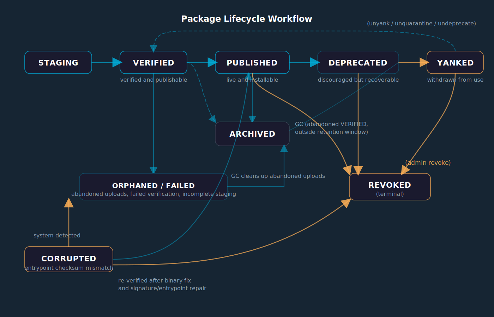

# Repository — Philosophy and Architecture

The Globular Repository is the **first layer of the four-layer truth model**. Before a service can run anywhere in the cluster, it must exist here as a published, verified artifact. Nothing enters the convergence pipeline without passing through the repository first.

This page explains what the repository is, how it thinks about packages, and how everything fits together — from your first `pkg publish` to GC cleaning up artifacts years later.

---

## What the Repository Is Not

The repository is not apt, yum, or npm. Those package managers are delivery mechanisms: you ask for a name and a version, you get a file. They don't know what's running, what's installed, or whether removing something is safe.

Globular's repository is an **artifact lifecycle manager**. It knows:

- **What exists** — every artifact ever published, with full provenance
- **What is safe** — which artifacts are actively deployed and must not be touched
- **What has been superseded** — which versions are no longer useful and can be reclaimed
- **What is forbidden** — which artifacts are yanked, quarantined, or revoked and must never be installed

The repository is consulted at every stage of a service's life. The controller asks it before writing desired state. The node-agent asks it before installing. The GC asks it before archiving. It is never a passive store.

---

## The Identity Model

Every artifact published to the repository gets a `build_id` — a UUIDv7 generated at upload time. This is the **sole authoritative identity** used throughout the cluster.

| Field | Role | Who controls it |
|---|---|---|
| `build_id` | Convergence identity | Repository (generated, never client-supplied) |
| `version` | Human label | Publisher (semver, validated by repository) |
| `build_number` | Display counter | Repository (derived, informational only) |
| `digest` | Content fingerprint | Repository (SHA256 of the archive bytes) |
| `channel` | Release track | Publisher (`stable`, `candidate`, `canary`, `dev`, `bootstrap`) |

When the controller decides whether a node is converged, it compares a single string:

```
desired.build_id == installed.build_id  →  converged
```

No version comparison. No checksum. No timestamp. One string equality.

This means that two builds of the same version (`0.0.3 build 1` and `0.0.3 build 2`) are different artifacts — different `build_id`s — and the cluster treats them as such.

---

## The Lifecycle State Machine

Every artifact moves through a defined set of states. The states are not cosmetic — they control what the cluster will and will not do with the artifact.



### System states (automated)

| State | Who sets it | Meaning |
|---|---|---|
| `STAGING` | Upload start | Archive is being received |
| `VERIFIED` | Upload complete | Checksum computed, archive validated |
| `PUBLISHED` | `completePublish()` | Fully available. Descriptor registered. |
| `ORPHANED` | Server | Descriptor registration failed after upload |
| `FAILED` | Server | Pipeline error — artifact is unusable |
| `CORRUPTED` | Integrity check | `entrypoint_checksum` mismatch detected post-publish |

### Operator states (manual)

| State | Command | Who may set it | Meaning |
|---|---|---|---|
| `DEPRECATED` | `pkg deprecate` | Publisher / owner / admin | Superseded. Still installable by explicit pin. Skipped by latest resolver. |
| `YANKED` | `pkg yank` | Publisher / owner / admin | Blocked. Hidden from discovery, downloads rejected. |
| `QUARANTINED` | `pkg quarantine` | Admin only | Security hold. Same as YANKED but requires admin to lift. |
| `REVOKED` | `pkg revoke` | Admin or owner | Terminal. No recovery. |
| `ARCHIVED` | `repository cleanup` / GC | GC or admin | Soft-deleted. Hidden from catalog. Binary retained. Retrievable by owners/admins only. |

### What each state allows

| State | Search | Latest resolve | Download | Pin install | Rollback |
|---|---|---|---|---|---|
| PUBLISHED | yes | yes | yes | yes | yes |
| DEPRECATED | yes | **no** | yes+warn | yes | yes |
| YANKED | no | no | **no** | **no** | **no** |
| QUARANTINED | no | no | **no** | **no** | **no** |
| REVOKED | no | no | **no** | **no** | **no** |
| ARCHIVED | no | no | owner/admin | **no** | **no** |
| CORRUPTED | no | no | **no** | **no** | **no** |

---

## Version Allocation

The repository is the **sole authority on version numbers**. You do not decide what version a build gets — you state your intent and the repository allocates.

```bash
# Let the repository assign the next patch version
globular pkg publish --file my_service.tgz --repository repo.globular.internal --bump patch

# Or with the deploy pipeline (recommended for services)
globular deploy my_service --bump minor
```

The `--bump` flag triggers `AllocateUpload` on the server:
1. Server finds the highest PUBLISHED version for this package+platform
2. Server increments according to `patch/minor/major`
3. Server reserves a slot with a 5-minute TTL to prevent concurrent collisions
4. Server returns the allocated `version`, `build_number`, `build_id`, and `reservation_id`
5. Your upload is tied to that reservation — it arrives with the correct identity already established

This is why there are no race conditions. Two CI jobs building simultaneously get different reservations and different versions.

---

## Channels

Every artifact belongs to a release channel. Channels let you run a canary track or a bootstrap track without polluting the stable catalog.

| Channel | Use case |
|---|---|
| `stable` | Production releases. Default. |
| `candidate` | Release candidates, final testing before stable. |
| `canary` | Progressive rollout — subset of nodes. |
| `dev` | Development builds. Not for production. |
| `bootstrap` | Day-0 artifacts installed before the cluster is fully up. |

```bash
globular pkg publish --file my_service.tgz --repository repo.globular.internal \
  --bump patch --channel candidate
```

The reconciler respects channels — a node on the `stable` track will not install a `canary` artifact unless explicitly told to.

---

## What the Repository Enforces (Invariants)

The repository is not a passive store. It enforces invariants at write time and rejects anything that would violate them.

| Invariant | Rule |
|---|---|
| **Immutability** | A PUBLISHED artifact at `(publisher, name, version, platform)` cannot be overwritten with different content. Use `--force` to delete and re-upload, but only before deployment. |
| **Monotonicity** | You cannot publish version 0.0.2 if 0.0.8 is already PUBLISHED. The version history only moves forward. |
| **Publisher identity** | The JWT token must match the `publisher` field in the package manifest. You cannot impersonate another publisher. |
| **Build ID sovereignty** | The client never provides a `build_id`. The repository generates it. Any client-supplied value is ignored. |
| **State machine** | Transitions are validated server-side. You cannot jump from YANKED directly to DEPRECATED — invalid transitions are rejected. |
| **Founding quorum** | The first three nodes of any cluster must have core+control-plane+storage profiles. The repository enforces this at join time. Without three MinIO nodes, the artifact store itself is a single point of failure. |
| **Artifact laws** | Three formal laws are checked at `completePublish()` time — see below. A violation blocks promotion to PUBLISHED. |

### Artifact Laws

Three named laws are enforced just before an artifact transitions to PUBLISHED. A violation causes promotion to fail (the artifact remains VERIFIED until the spec is fixed and re-submitted):

| Law | ID | Rule |
|---|---|---|
| No dep on application | `INV_C_NO_DEP_ON_APPLICATION` | No artifact may list an `APPLICATION`-kind package in its `hard_deps`. Applications are leaf consumers — nothing in the cluster should depend on them. Declaring such a dep means the dependency graph is inverted. |
| Command isolation | `LAW_COMMAND_NO_CLUSTER_RUNTIME_DEPS` | `COMMAND`-kind artifacts must not declare cluster `runtime_uses`. Commands are standalone binaries with no service-graph relationships. Adding runtime_uses creates invisible operational coupling with no enforcement mechanism. |
| Acyclic hard deps | `INV_D_HARD_DEPS_ACYCLIC` | The `hard_deps` graph across all PUBLISHED artifacts plus the incoming one must be a DAG. A cycle means two packages each require the other to be installed first — an install deadlock. |

Violations are returned as structured errors with the law ID and the cycle path (for `INV_D`), making them actionable in CI.

---

## Storage Architecture

Artifacts have two kinds of data, stored separately:

```
MinIO (binary storage)
└── artifacts/
    └── {publisher}/{name}/{version}/{platform}/b{build_number}/
        ├── {name}.tgz           ← the package archive
        └── {name}.manifest.json ← embedded metadata copy (source of truth for rebuild)

ScyllaDB (catalog index) — keyspace: repository, table: manifests
  Columns: artifact_key, manifest_json, publish_state, publisher_id, name, version,
           platform, build_number, checksum, entrypoint_checksum, size_bytes,
           kind, channel, created_at
  Indexes:
    idx_entrypoint_checksum  ← reverse lookup: binary SHA256 → manifest
                               (used by ResolveByEntrypointChecksum for drift detection)
    idx_channel              ← filter artifacts by release channel
```

Both stores must be consistent. `completePublish()` writes to both atomically (write MinIO manifest, then upsert ScyllaDB). If ScyllaDB is unavailable, the manifest write to MinIO still happens — the catalog is rebuilt from MinIO on the next startup via the migration pass.

The binary (`.tgz`) is never deleted by normal lifecycle operations — not by deprecation, yank, or even quarantine. Only `repository delete --force` removes the binary. `ARCHIVED` state hides the artifact from the catalog but the binary stays in MinIO.

---

## Garbage Collection and Reachability

The GC uses a **reachability engine**, not a simple age-based rule.

An artifact is **reachable** (protected from GC) if:
- It is within the **retention window** (last 3 PUBLISHED builds per `publisher/name/platform` series), OR
- Its `build_id` is held by **desired state**, **installed state**, a **workflow run**, or a **rollback pin** in etcd

An artifact is **unreachable** (eligible for archiving) only when both conditions fail — it is outside the retention window AND nothing in the cluster is holding a reference to it.

GC archives artifacts to `ARCHIVED` state — it does **not** delete binaries. The binary stays in MinIO. ARCHIVED artifacts are invisible to the catalog but owners and admins can still download them. A future purge step may hard-delete ARCHIVED artifacts.

GC never touches: `YANKED`, `QUARANTINED`, `REVOKED`, `CORRUPTED`. Those are moderation states managed by humans.

```bash
# Preview what GC would archive
globular repository cleanup --dry-run

# Run GC
globular repository cleanup
```

---

## The Publish Pipeline

Here is the complete sequence for a standard `pkg publish --bump patch`:

```
1. CLI reads archive, computes SHA256 locally (one read — no double-read race)
2. CLI calls AllocateUpload(intent=BUMP_PATCH) → server returns version+build_id+reservation_id
3. CLI streams archive to UploadArtifact with reservation_id
4. Server receives archive:
   a. Computes SHA256 of received bytes
   b. Writes archive to MinIO
   c. Transitions state STAGING → VERIFIED
5. Server calls completePublish():
   a. Runs artifact law validation (INV_C, LAW_COMMAND, INV_D) — violation blocks promotion
   b. Registers PackageDescriptor in ResourceService (RBAC-correct, using caller JWT)
      — best-effort: failure here does NOT block promotion; artifact still reaches PUBLISHED
   c. Writes manifest to MinIO (manifest.json)
   d. Upserts manifest in ScyllaDB (both indexes updated)
   e. Transitions state VERIFIED → PUBLISHED
6. CLI calls GetArtifactManifest to confirm PUBLISHED state
7. CLI prints: name, version, build_id, digest, size, duration
```

If step 5 fails due to an **artifact law violation**, the artifact stays VERIFIED and the error is returned to the caller — fix the spec and re-publish. If step 5 fails due to an **infrastructure error** (ResourceService/ScyllaDB unavailable), the artifact lands in `ORPHANED` state — it exists in MinIO but is not in the catalog. The repository startup migration detects orphans and retries `completePublish()` automatically.

---

## Working with the CLI

### Publish a package

```bash
# Recommended: let the repository allocate the version
globular pkg publish \
  --file my_service_linux_amd64.tgz \
  --repository repo.globular.internal \
  --bump patch

# With explicit channel
globular pkg publish \
  --file my_service_linux_amd64.tgz \
  --repository repo.globular.internal \
  --bump minor --channel candidate

# Dry-run: validate without uploading
globular pkg publish \
  --file my_service_linux_amd64.tgz \
  --repository repo.globular.internal \
  --dry-run
```

### Inspect artifacts

```bash
# All versions of a package
globular pkg info my_service

# Scan repository for anomalies
globular repository scan
globular repository scan --package my_service
```

### Lifecycle management

```bash
# Deprecate — still installable by pin, skipped by latest resolver
globular pkg deprecate publisher@example.com/my_service 0.0.3

# Restore deprecated → published
globular pkg undeprecate publisher@example.com/my_service 0.0.3

# Yank — hidden from discovery, downloads blocked
globular pkg yank publisher@example.com/my_service 0.0.2 --reason "critical memory leak"

# Restore yanked → published
globular pkg unyank publisher@example.com/my_service 0.0.2

# Quarantine — admin security hold
globular pkg quarantine publisher@example.com/my_service 0.0.1 --reason "CVE-2026-1234"

# Lift quarantine
globular pkg unquarantine publisher@example.com/my_service 0.0.1

# Permanently revoke (terminal — no recovery)
globular pkg revoke publisher@example.com/my_service 0.0.1 --reason "supply chain compromise"

# All state commands accept --platform and --build-number to target specific builds
globular pkg yank publisher@example.com/my_service 0.0.2 \
  --platform linux_arm64 --build-number 3
```

### Repository maintenance

```bash
# Preview GC
globular repository cleanup --dry-run

# Run GC (archives unreachable artifacts)
globular repository cleanup

# Delete a specific version (hard delete — use with care)
globular repository delete my_service 0.0.1
globular repository delete my_service 0.0.1 --force   # even if still installed
```

---

## Where This Fits in the Four Layers

```
Layer 1: Repository    ← "Does this artifact exist and is it healthy?"
Layer 2: Desired       ← "What build_id should run on each node?"
Layer 3: Installed     ← "What build_id is actually installed?"
Layer 4: Runtime       ← "Is the installed service active and healthy?"
```

The repository answers Layer 1. It is consulted before any write to Layer 2 (the controller rejects desired-state writes for non-PUBLISHED artifacts). It is the only source of the `build_id` that flows through Layers 2 and 3. When Layer 4 reports a service as CORRUPTED (entrypoint_checksum mismatch), the repository moves the artifact to `CORRUPTED` state so Layer 2 can no longer use it.

---

## Related Pages

- [Publishing Services](publishing-services.md) — step-by-step build and publish workflow
- [Repository Repair](repository-repair.md) — diagnose anomalies and repair inconsistencies
- [Convergence Model](convergence-model.md) — how all four layers interact
- [Deployment Philosophy](deployment-philosophy.md) — why rollback is forbidden and what to do instead
